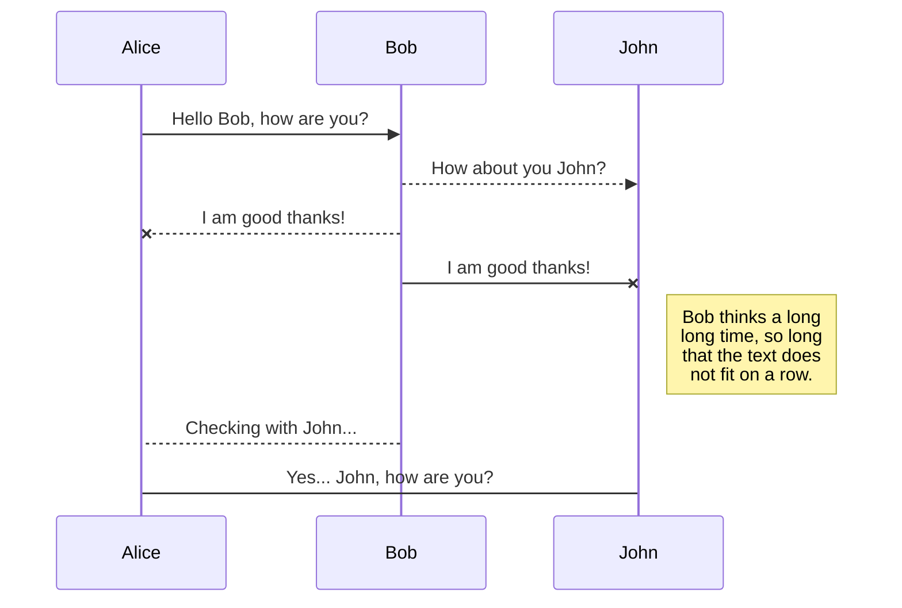
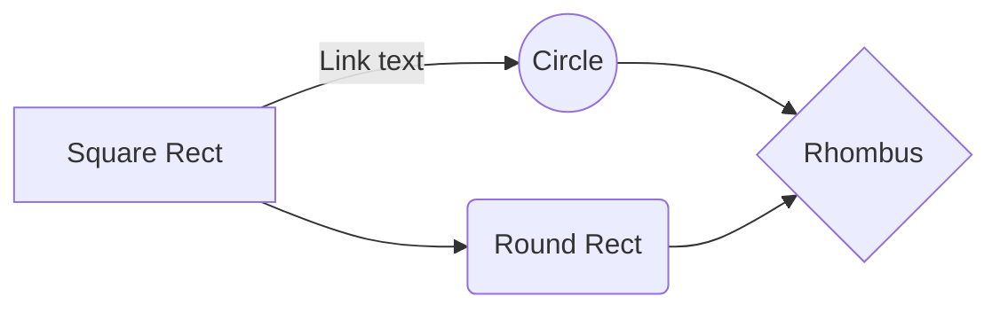

# **DOCUMENTAZIONE PROGETTO: MENTCARE**
## ESAME DI INGEGNERIA DEL SOFTWARE
### Studente: Amore Benedetta
### Matricola: VR 445458
### Studente: Frasson Alessia
### Matricola: VR 447848
### Docente: Mariano Ceccato
### Anno Accademico: 2020/2021

#  
## INDICE

 - ### REQUISITI
 - ### SCENARI
 - ### DESIGN
 - USE CASE COMPLETO DI TUTTI GLI UTENTI DEL SISTEMA
 - ACTIVITY COMPLETO PER TUTTI GLI UTENTI DEL SISTEMA
 - SEQUENCE DIAGRAM
 - CLASS DIAGRAM
 - ### QUALITY ASSURANCE
 - TEST SELECTION (SCENARI E DATI)
 - TEST COVERAGE (UNIT TEST)
 - ### SCELTE IMPLEMENTATIVE 
#
# REQUISITI
Al fine di garantire la praticità a tutti gli utenti, il sistema di cliniche prevede un'applicazione utilizzabile sia da computer sia da smartphone. 
L'applicazione gestisce in un database un sistema di cliniche diurne, i pazienti ospitati e consente diversi tipi di accesso e attività. Le cliniche in gestione sono sia strutture diurne, come comunità, in cui i pazienti si recano per svolgere attività ricreative, incontrare medici specialisti e ricevere le cure adeguate, sia cliniche ospedaliere.
Le informazioni dei pazienti riguardano i dati personali, le cartelle cliniche, i trattamenti ricevuti, per esempio prescrizione di farmaci o visite mediche. Questi dati sono soggetti al trattamento della privacy, per i quali il tutore o il paziente stesso firmano il modulo di consenso. Inoltre il manager delle cliniche ha il consenso a rilasciare i dati alle forze dell'ordine, per compiere indagini giudiziarie o processi.
Il paziente non ha alcun tipo di interazione con il sistema, perciò è necessario memorizzare il contatto di un parente o tutore, che sarà usato in caso di urgenze o allarmi. Alcuni di questi casi sono: 
 - il paziente può compiere azioni pericolose per se stesso o per gli altri
 - il paziente può perdersi nella clinica
 - il paziente può dimenticare (volontariamente) una visita
 - il paziente può perdere (volontariamente) la prescrizione
 In queste situazioni un medico o un infermiere dovrà segnalare l'accaduto tramite un allert nel sistema.
 Gli utenti del sistema sono:
 - staff medico: medici, infermieri e infermieri a domicilio
 - staff non medico: receptionist, IT e manutentori, amministratore
#
# SCENARI

 - SEGNALAZIONE DI ALLERT
 Un medico o un infermiere può segnalare una situazione urgente o di pericolo per un certo paziente. L'allarme viene lanciato inserendo l'allert dall'applicazione cellulare o da computer. La chiamata arriva sia ai colleghi sia al parente del paziente, di cui si ha memorizzato il numero nel database;
 
 - UTILIZZO DA PARTE DEL MEDICO CURANTE
 I medici possono accedere al database con login medica e password, dalla propria area privata vedono la lista di pazienti e possono aggiornare la cartella clinica di ognuno. Nella cartella devono inserire la diagnosi con l'eventuale stato di pericolosità e le terapie (farmacologiche e psicologiche) prescritte e somministrate. Dalla home possono vedere e stampare lo storico di ogni paziente;
 
 - UTILIZZO DA PARTE DELL'INFERMIERE
 Gli infermieri possono accedere al database con login medica e password, dalla propria area privata vedono la lista di pazienti e possono aggiornare la cartella clinica di ognuno. Nella cartella devono inserire lo svolgimento delle terapie psicologiche e la somministrazione dei farmaci prescritti. Dalla home possono vedere e stampare lo storico di ogni paziente;
 
 - UTILIZZO DA PARTE DELLA RECEPTIONIST
 Le receptionist accedono al sistema con la propria login e password e possono vedere l'agenda e il calendario di ogni medico per prendere gli appuntamenti con i pazienti o con i loro famigliari;
 
 - UTILIZZO DA PARTE DEL MANAGER DELLE CLINICHE
Il manager ha accesso come amministratore e può inserire un nuovo paziente, creandone la cartella clinica, in questa fase farà firmare il modulo per il trattamento dei dati personali e il consenso di fornire informazioni necessarie a eventuali indagini. Quando un paziente finisce la cura la cartella verrà archiviata. Il manager potrà vedere un report mensile relativo all'andamento economico delle cliniche e al numero di pazienti in terapia.
#
# DESIGN
## USE CASE
### MEDICO
Le attività previste per lo staff medico sono:
 - Accesso al sistema con login e password mediche;
 - Nella homepage, visualizzare la lista di pazienti;
 - Dalla homepage, segnalare un allert nel caso di situazioni critiche;
 - Dalla homepage, aprire la cartella clinica dei pazienti; 
 - Dalla cartella clinica inserire le diagnosi, le terapie prescritte, le attività svolte e i farmaci somministrati;
 - Dalla homepage, visualizzare e stampare lo storico di un paziente.

### INFERMIERE e INFERMIERE A DOMICILIO
Le attività previste per gli infermieri sono:
 - Accesso al sistema con login e password sub-mediche;
 - Nella homepage, visualizzare la lista di pazienti;
 - Dalla homepage, segnalare un allert nel caso di situazioni critiche; 
 - Dalla homepage, aprire la cartella clinica dei pazienti;
 - Dalla cartella clinica inserire le attività svolte e i farmaci somministrati;
 - Dalla homepage, visualizzare e stampare lo storico di un paziente.
 
### RECEPTIONIST
Le attività previste per le receptionist sono:
 - Accesso al sistema con login e password semplici;
 - Nella homepage, visualizzare il calendario e l'agenda di ogni medico;
 - Dal calendario inserire un appuntamento con un paziente o con un famigliare.
 
### MANAGER
Le attività previste per il manager sono:
 - Accesso al sistema con login e password da amministratore;
 - Inserire un nuovo paziente e creare una cartella clinica contenente l'anagrafica e il modulo per la privacy;
 - Archiviare la cartella clinica dei pazienti che concludono il trattamento;
 - Visualizzare lo storico del paziente ed esportarlo su richiesta;
 - Visualizzare il report mensile amministrativo ed economico.
Il report contiene il numero di pazienti in ogni clinica diurna, il numero di pazienti che sono stati registrati e il numero di pazienti che hanno concluso le cure, il numero di pazienti visitati nelle cliniche ospedaliere e, per ogni clinica, il totale del costo dei farmaci prescritti e somministrati, suddivisi in dosi. 

#
## ACTIVITY DIAGRAM
### MEDICO

### INFERMIERE

### RECEPTIONIST

### MANAGER

#
## SEQUENCE DIAGRAM

#
## CLASS DIAGRAM

#
# QUALITY ASSURANCE
## TEST SELECTION

## TEST COVERAGE

#
# SCELTE IMPLEMENTATIVE

# Markdown extensions

StackEdit extends the standard Markdown syntax by adding extra **Markdown extensions**, providing you with some nice features.

> **ProTip:** You can disable any **Markdown extension** in the **File properties** dialog.

## SmartyPants

SmartyPants converts ASCII punctuation characters into "smart" typographic punctuation HTML entities. For example:

|                |ASCII                          |HTML                         |
|----------------|-------------------------------|-----------------------------|
|Single backticks|`'Isn't this fun?'`            |'Isn't this fun?'            |
|Quotes          |`"Isn't this fun?"`            |"Isn't this fun?"            |
|Dashes          |`-- is en-dash, --- is em-dash`|-- is en-dash, --- is em-dash|

## UML diagrams

You can render UML diagrams using [Mermaid](https://mermaidjs.github.io/). For example, this will produce a sequence diagram:

And this will produce a flow chart:

